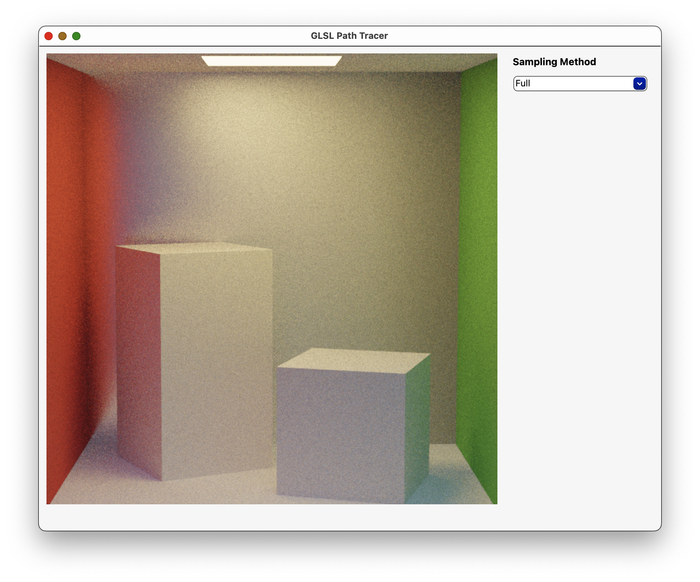

#GLSL Pathtracer

### Overview

A GLSL-based application to showcase different rendering methods associated with the Monte Carlo Light Transport algorithm.

### Build Instructions

The easiest way to get this program running is to use an IDE like QT Creator and select the project root file at `shaderPathtracer.pro`.

### Hardware Compatibility

Note, any JSON scenes that contains an OBJ file reference will fail to load on MacOS (due to GPU limitations).
